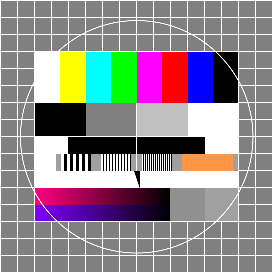

HEADER:

# 1. Titel
## 2. Titel
### 3. Titel
#### 4. Titel
##### 5. Titel
###### 6. Titel

EMPHASIS:

__fett__ - 2 unterstriche vorne und hinten

**fett** - 2 sternchen vorne und hinten

_kursiv_ - 1 unterstrich vorne und hinten

*kursiv* - 1 sternchen vorne und hinten

**fett und _kursiv_** - ein mix von beidem

_kursiv und **fett**_ - ein weiterer mix von beidem

PARAGRAPH:

Eine Zeile Text

Eine
Zeile
Text

Mehrere

Zeilen

Text

Wenn wir Text in die selbe Zeile schreiben, wird es zu einem Paragraphen, wenn wir ihn direkt untereinander schreiben auch. Einen neuen paragraphen starten wir, indem wir eine zeile frei lassen.

LISTS:

1. Ein Eintrag
2. Ein Weiterer Eintrag
1. Noch ein Eintrag
4. Noch ein Eintrag

- Ein Eintrag
- Noch ein Eintrag
    - Ein Untereintrag
    - Ein weiterer Untereintrag
        - Eine Ebene tiefer
- Wieder am Anfang

  Ich bin ein Paragraph, innerhalb der Liste

Ich bin ein normaler Paragraph

LINKS:

[Dies ist ein Link zu Google](https://www.google.de)

[Dies ist auch ein Link zu Google](https://www.google.de "Google")

IMAGES:

Ein lokales Bild:



Ein Bild aus dem Internet:


CODE:

Eine Zeile Code: `console.log("Hello World");`

Mehrere Zeilen Code:

```
console.log("Hallo Welt");

alert("Hello");
```

BLOCKQUOTES:

> Ich bin ein **Zitat**!

> Ich bin ein eingerückter
> Paragraph!

HORIZONTAL RULE:

---

***

YOUTUBE VIDEO:

Um ein anderes Video anzuzeigen, müssen wir nur den CODE ändern, beim image ist wichtig das wir das /0.jpg behalten.

[](http://www.youtube.com/watch?v=TNhaISOUy6Q)

[](https://www.google.de)

// | Element | Beschreibung |
// |---------|--------------|
// | käse    | kuchen       |

[]()

