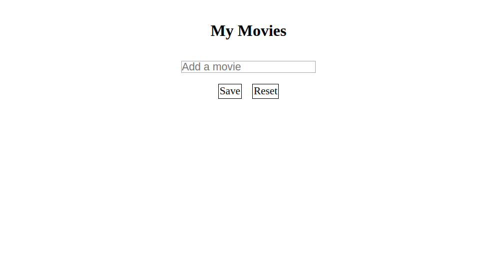
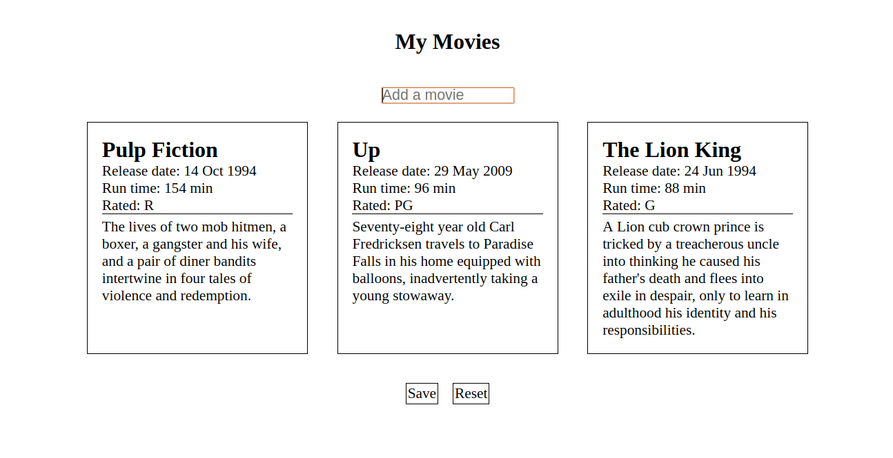
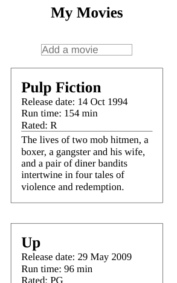

# Movie List

Create a movie list by populating movies on the page. 

**Instructions**: 
* Import and export the classes as needed. 
* Work from the `index.js` file. 
* Resolve the promise from the `apiCall.js` file. Once this is resolved, display the data on the page. Note: you do not need to change any code from the `view.js` or the `apiCall.js`. You only need to add a token from the API to the `apiCall.js` file.
* A movie should only be displayed once. If a user inputs a movie twice, display an alert.
* The user should be able to save their movie list so that when the page is refreshed, their movie list will still be displayed. 
* The user should be able to reset the page - this means that the movie list should be removed entirely from the page and nothing should appear if the page is refreshed. 

**Notes**
* Important: use the following API for this exercise: https://www.omdbapi.com/

**Images**
* Empty Movie List

* Desktop Movie List

* Mobile Movie List

